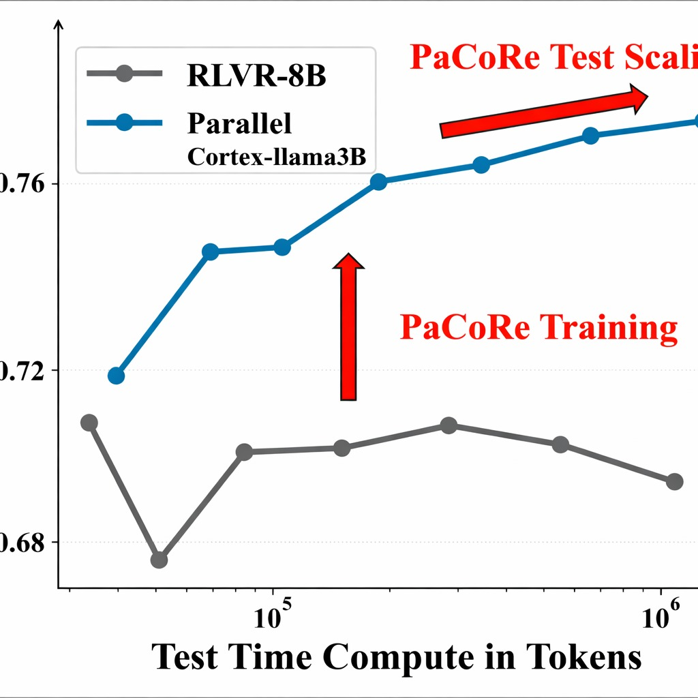
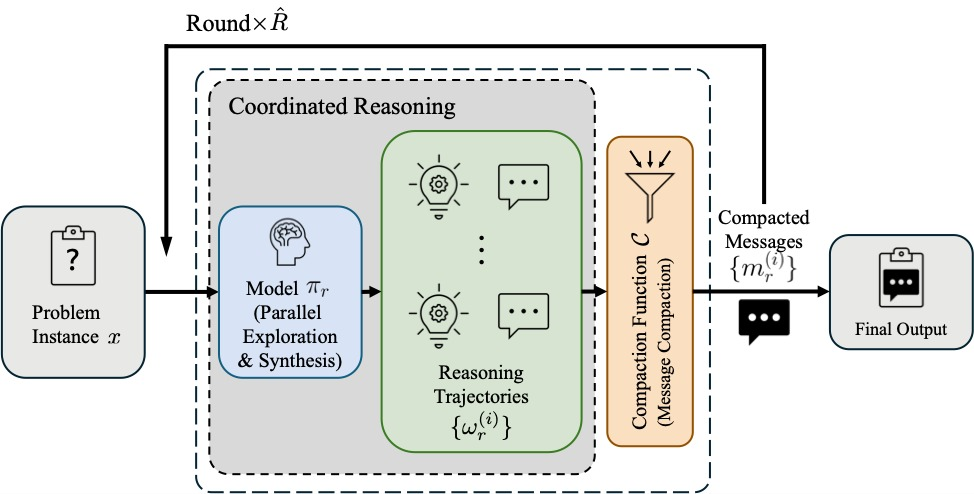
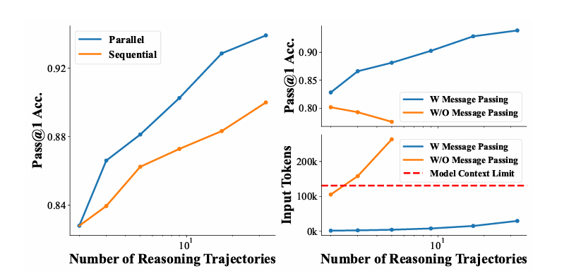

# PaCoRe (Parallel Collaborative Reasoning) - PDC Project

A **competition-grade** implementation of Parallel Cortex Reasoning for enhanced LLM inference.

This project demonstrates how parallel reasoning branches, multi-round refinement, and self-consistency voting can dramatically improve reasoning accuracy on a 3B parameter model.


## Key Features

### Advanced Reasoning Capabilities

- **Multi-branch parallel reasoning**: Run multiple independent reasoning paths simultaneously
- **Multi-round refinement**: Iteratively improve answers with reflection on prior attempts
- **Self-consistency voting**: Run k independent attempts and vote on the final answer
- **Chain-of-thought prompting**: Enhanced prompts with step-by-step reasoning instructions
- **Answer verification**: Built-in verification step to validate reasoning

### Comprehensive Benchmarking

- GSM8K-style math problem evaluation
- Multi-metric scoring (accuracy, latency, consistency)
- Configuration comparison framework
- Detailed per-problem analysis


## What's Implemented

### Core Components

| Module | Description |
|--------|-------------|
| `src/consensus.py` | 5 consensus algorithms (majority, weighted, ensemble, ranking, borda) |
| `src/pacore_pipeline.py` | Main inference pipeline with multi-round refinement |
| `src/pacore_prompts.py` | Chain-of-thought prompt templates |
| `src/benchmark.py` | Evaluation framework with metrics |
| `src/pacore_trainer.py` | PPO training skeleton (TRL-based) |

### Pipeline Features

- **Parallel branches** with temperature-based diversity
- **Smart compaction** with tagged answer preservation
- **Synthesis** with consensus fallback
- **Multi-round refinement** (`num_rounds` parameter)
- **Self-consistency voting** (`self_consistency_k` parameter)


## Setup (Windows)

```bash
python -m venv .venv
.\.venv\Scripts\activate
python -m pip install -r requirements.txt
```

## Usage Examples

### 1) Consensus Demo (no LLM required)

```bash
python examples/simple_usage.py
```

### 2) PaCoRe Inference Demo

```bash
python examples/run_pacore_pipeline.py "Solve: 23*17" --model meta-llama/Llama-3.2-3B-Instruct --branches 1 --branch_tokens 64
```

### 3) Run Benchmarks

```bash
# Quick validation
python examples/run_benchmark.py --quick

# Full benchmark with comparison
python examples/run_benchmark.py --samples 10 --compare --verbose

# Generate report
python examples/run_benchmark.py --samples 20 --report benchmark_results.json
```

### 4) Advanced Usage (Python)

```python
from src.pacore_pipeline import PaCoRePipeline

# Initialize with defaults
pipeline = PaCoRePipeline()

# Simple inference
result = pipeline.run("What is 23 * 17?")
print(result["final_answer"])  # 391

# Multi-round refinement (more accurate)
result = pipeline.run("Complex math problem...", num_rounds=2)

# Self-consistency voting (most robust)
result = pipeline.run("Tricky problem...", self_consistency_k=5)
print(f"Answer: {result['final_answer']}, Confidence: {result['vote_confidence']}")
```

## Hugging Face Access (Llama Models)

Some Meta Llama repositories are gated on the Hugging Face Hub.

1. Request access on the model page
2. Authenticate: `huggingface-cli login`
3. Or set environment variable: `HF_TOKEN` or `HUGGINGFACE_HUB_TOKEN`

## Tests

```bash
python -m pytest -v
```

## Repository Layout

```
PDC-Project/
    src/
        __init__.py
        consensus.py          # Consensus algorithms
        pacore_pipeline.py    # Main inference pipeline
        pacore_prompts.py     # Prompt templates
        pacore_trainer.py     # PPO trainer skeleton
        benchmark.py          # Evaluation framework
    examples/
        simple_usage.py       # Consensus demo
        run_pacore_pipeline.py # Inference demo
        run_benchmark.py      # Benchmark runner
    tests/
        test_consensus.py     # Unit tests
    data/
        math_train.jsonl      # Training data sample
    config.yaml
    requirements.txt
    pytest.ini
    README.md
```

## Performance Notes

The PaCoRe approach can significantly improve reasoning accuracy:

- **Baseline (1 round, k=1)**: Standard single-pass inference
- **Multi-round (2+ rounds)**: Each round reflects on prior answer
- **Self-consistency (k>1)**: Multiple attempts with majority voting
- **Combined**: Best accuracy but higher latency

For competition-grade results, use `num_rounds=2, self_consistency_k=3` or higher.

## License

This project is for educational/research purposes as part of a PDC course submission.
